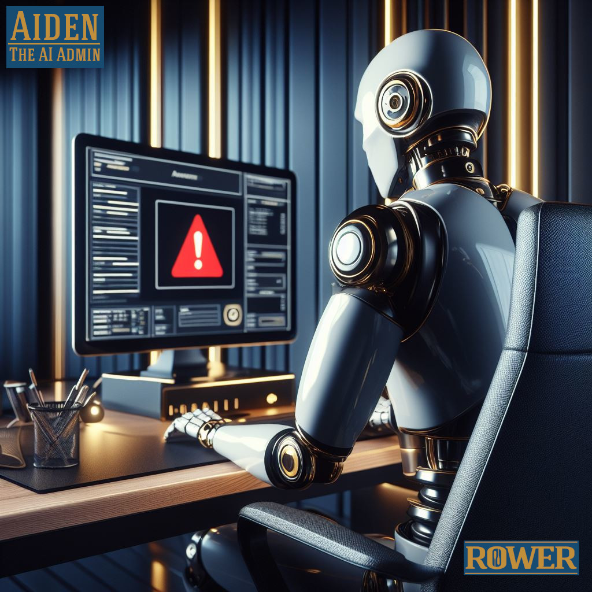

# Aiden - The AI Admin 🤖
This project is a showcase for "taming complexity" using *adaptive* machine learning. It is an abstraction of a real-world use case from our portfolio that we can run in a controlled environment. 

    

Everyone *talks* about AI, but Rower is putting forward a working example of what we see emerging as a cohesive new class of software. These applications forge-weld together what previously was thought of as the distinct domains of "analytics" and "operational" systems. This new hybrid form centers on advanced intelligent tooling closely coupled with [human-centered design (HCD)](https://en.wikipedia.org/wiki/Human-centered_design). In full, it underscores our view of how analytic and operational systems can *no longer afford to remain separate* without significant adverse cost to an organization. 

## Summary 📰
"Aiden" is a narrowly scoped proof-of-concept. At its heart it is a flexible set of algorithms that perform analyses of network telemetry. The use case is to support of a systems administrator in a mission-critical role of monitoring open web traffic as it arrives at client endpoints. It reviews an enriched 'funnel' of suspicious open-web traffic and discovers threat-actor patterns. With Aiden's ability to analyze data "in flight" it is able to rapidly offer responses that prompt the operator to review findings and confirm/enact the mitigation strategy from the same user interface. Both *analysis* and *operations* are performed in the same app with interactive tooling that prompts the user to action.  

## Technology 📐
Even though this is simply a proof of concept, we plan to showcase *how* we build and deploy a full multi-targeting codebase to support the work wherever it occurs. We employ the [Avalonia](https://avaloniaui.net/) framework to deploy versions of these applications to desktop, mobile and web from a single code base. And *under the hood* it also leverages a blend of some of the most recent developments in AI and machine learning. The key underlying technology we're using for "Aiden" is Microsoft's [Semantic Kernel](https://github.com/microsoft/semantic-kernel), which can be thought of as an orchestrator for large language models - but can also serve to connect a wide variety of tools such as optimized search, process planning and other customized calculations. 

Aside from our use of .NET here, it should be noted that Semantic Kernel *also* has support for python and java. More can be learned [in their documentation](https://learn.microsoft.com/en-us/semantic-kernel/overview/). This is a rapidly growing area of work and study, and Rower has the deep experience and leading-edge acumen to help organizations place these new tools into service.

## Our commitment to open source 🤝

While we see this example as emblematic of our company's innovation in this space, it's worth mentioning that all of the tools and frameworks in this project are fully open-source.  Rower holds that the transparency and collaboration inherent to open-source initiatives fosters trustworthiness in both product and process. Through our leveraging of, contributing to and supporting open-source tools, we maintain our commitment to building robust, reliable, secure and sustainable systems with our clients. 